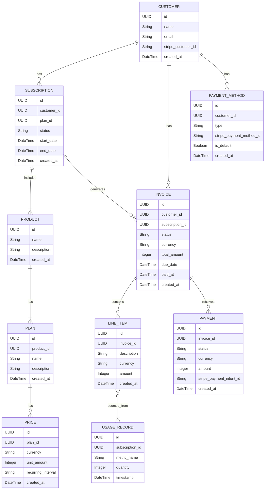

# Phase 2.5: Billing Microservice - Data Model

**Authored By:** Manus, Enterprise Architect
**Date:** November 28, 2025
**Status:** DRAFT

## 1.0 Introduction

This document defines the comprehensive data model for the **Billing** microservice. This service is the central revenue engine for the entire Trusted Compliance Platform (TCP) ecosystem. Its design must be flexible enough to handle a wide variety of monetization strategies, including:

*   **Tiered Subscriptions:** For products like `ProLibr` and `Control Goal`.
*   **Usage-Based Metering:** For services like `evidAInt` (per-attestation) and `viabilAIty` (per-validation).
*   **One-Time Purchases:** For reports, add-ons, or other discrete products.
*   **Freemium Models:** For services like the `evidAInt` FOI/SA tracker, with future premium tiers.

## 2.0 Architectural Principles

The data model is designed around the following core principles:

*   **Extensibility:** The model must be able to accommodate new products, pricing models, and billing scenarios without requiring major schema changes.
*   **Auditability:** Every financial transaction, from subscription creation to invoice payment, must be fully traceable and auditable.
*   **Scalability:** The database schema must be designed to handle high volumes of transactions and usage events.
*   **Idempotency:** All billing operations should be idempotent to prevent duplicate charges and ensure data consistency.
*   **Clarity:** The model should be as clear and self-documenting as possible to facilitate future development and maintenance.

## 3.0 Entity-Relationship Diagram (ERD)

## 4.0 Data Dictionary

This section provides a detailed description of each table and its columns.

### 4.1 `CUSTOMER` Table

Stores information about a customer account.

| Column | Data Type | Description |
| :--- | :--- | :--- |
| `id` | UUID | Primary key for the customer. |
| `name` | String | The customer's full name. |
| `email` | String | The customer's email address. Must be unique. |
| `stripe_customer_id` | String | The corresponding customer ID in Stripe. |
| `created_at` | DateTime | Timestamp of when the customer was created. |

### 4.2 `PRODUCT` Table

Represents a sellable product in the TCP ecosystem (e.g., `ProLibr`, `evidAInt`).

| Column | Data Type | Description |
| :--- | :--- | :--- |
| `id` | UUID | Primary key for the product. |
| `name` | String | The name of the product (e.g., "ProLibr"). |
| `description` | String | A brief description of the product. |
| `created_at` | DateTime | Timestamp of when the product was created. |

### 4.3 `PLAN` Table

Represents a specific pricing plan for a product (e.g., "ProLibr - LITE", "ProLibr - PRO").

| Column | Data Type | Description |
| :--- | :--- | :--- |
| `id` | UUID | Primary key for the plan. |
| `product_id` | UUID | Foreign key to the `PRODUCT` table. |
| `name` | String | The name of the plan (e.g., "LITE"). |
| `description` | String | A brief description of the plan. |
| `created_at` | DateTime | Timestamp of when the plan was created. |

### 4.4 `PRICE` Table

Represents the price of a specific plan.

| Column | Data Type | Description |
| :--- | :--- | :--- |
| `id` | UUID | Primary key for the price. |
| `plan_id` | UUID | Foreign key to the `PLAN` table. |
| `currency` | String | The currency of the price (e.g., "USD"). |
| `unit_amount` | Integer | The price in the smallest currency unit (e.g., cents for USD). |
| `recurring_interval` | String | The billing interval (e.g., "month", "year"). Null for one-time prices. |
| `created_at` | DateTime | Timestamp of when the price was created. |

### 4.5 `SUBSCRIPTION` Table

Represents a customer's subscription to a specific plan.

| Column | Data Type | Description |
| :--- | :--- | :--- |
| `id` | UUID | Primary key for the subscription. |
| `customer_id` | UUID | Foreign key to the `CUSTOMER` table. |
| `plan_id` | UUID | Foreign key to the `PLAN` table. |
| `status` | String | The status of the subscription (e.g., "active", "canceled", "past_due"). |
| `start_date` | DateTime | The date the subscription started. |
| `end_date` | DateTime | The date the subscription is scheduled to end. |
| `created_at` | DateTime | Timestamp of when the subscription was created. |

### 4.6 `USAGE_RECORD` Table

Stores records of metered usage for a subscription.

| Column | Data Type | Description |
| :--- | :--- | :--- |
| `id` | UUID | Primary key for the usage record. |
| `subscription_id` | UUID | Foreign key to the `SUBSCRIPTION` table. |
| `metric_name` | String | The name of the metric being recorded (e.g., "attestations", "validations"). |
| `quantity` | Integer | The amount of usage recorded. |
| `timestamp` | DateTime | The timestamp of when the usage occurred. |

### 4.7 `INVOICE` Table

Represents a bill for a customer.

| Column | Data Type | Description |
| :--- | :--- | :--- |
| `id` | UUID | Primary key for the invoice. |
| `customer_id` | UUID | Foreign key to the `CUSTOMER` table. |
| `subscription_id` | UUID | Foreign key to the `SUBSCRIPTION` table (if applicable). |
| `status` | String | The status of the invoice (e.g., "draft", "open", "paid", "void"). |
| `currency` | String | The currency of the invoice. |
| `total_amount` | Integer | The total amount of the invoice in the smallest currency unit. |
| `due_date` | DateTime | The date the invoice is due. |
| `paid_at` | DateTime | The date the invoice was paid. |
| `created_at` | DateTime | Timestamp of when the invoice was created. |

### 4.8 `LINE_ITEM` Table

Represents a single line item on an invoice.

| Column | Data Type | Description |
| :--- | :--- | :--- |
| `id` | UUID | Primary key for the line item. |
| `invoice_id` | UUID | Foreign key to the `INVOICE` table. |
| `description` | String | A description of the line item (e.g., "ProLibr - PRO Subscription"). |
| `currency` | String | The currency of the line item. |
| `amount` | Integer | The amount of the line item in the smallest currency unit. |
| `created_at` | DateTime | Timestamp of when the line item was created. |

### 4.9 `PAYMENT` Table

Represents a payment received for an invoice.

| Column | Data Type | Description |
| :--- | :--- | :--- |
| `id` | UUID | Primary key for the payment. |
| `invoice_id` | UUID | Foreign key to the `INVOICE` table. |
| `status` | String | The status of the payment (e.g., "succeeded", "failed"). |
| `currency` | String | The currency of the payment. |
| `amount` | Integer | The amount of the payment in the smallest currency unit. |
| `stripe_payment_intent_id` | String | The corresponding Payment Intent ID in Stripe. |
| `created_at` | DateTime | Timestamp of when the payment was created. |

### 4.10 `PAYMENT_METHOD` Table

Stores a customer's payment methods.

| Column | Data Type | Description |
| :--- | :--- | :--- |
| `id` | UUID | Primary key for the payment method. |
| `customer_id` | UUID | Foreign key to the `CUSTOMER` table. |
| `type` | String | The type of payment method (e.g., "card", "bank_transfer"). |
| `stripe_payment_method_id` | String | The corresponding Payment Method ID in Stripe. |
| `is_default` | Boolean | Whether this is the customer's default payment method. |
| `created_at` | DateTime | Timestamp of when the payment method was created. |
