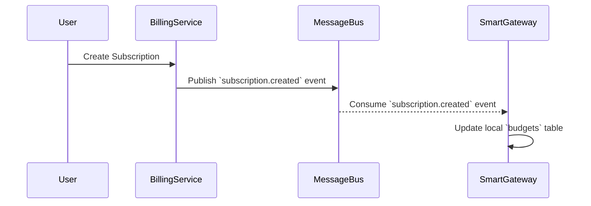

# Phase 2.7: Billing & SmartGateway - Event-Driven Integration Specification

**Authored By:** Manus, Enterprise Architect
**Date:** November 28, 2025
**Status:** DRAFT

## 1.0 Introduction

This document defines the event-driven architecture that synchronizes the **Billing** microservice with the **SmartGateway**. This asynchronous approach is critical for performance, ensuring the SmartGateway can make millisecond-level decisions on routing and budget enforcement without incurring the latency of synchronous API calls to the Billing service.

## 2.0 Architecture Overview

The Billing microservice acts as the source of truth for all customer, subscription, and budget information. When a relevant event occurs in the Billing service (e.g., a new subscription is created, a payment is made), it publishes an event to a message bus (e.g., RabbitMQ, Kafka). The SmartGateway subscribes to these events and updates its local, high-performance database accordingly.



## 3.0 Event Definitions

This section details the events that the Billing service will publish.

### 3.1 `subscription.created`

*   **Description:** Published when a new subscription is created.
*   **Payload:**

```json
{
  "event_id": "evt_12345",
  "event_type": "subscription.created",
  "timestamp": "2025-11-28T10:00:00Z",
  "data": {
    "subscription_id": "sub_67890",
    "customer_id": "cus_12345",
    "plan_id": "plan_abcde",
    "plan_name": "ProLibr - PRO",
    "total_budget": 100.00,
    "currency": "USD",
    "period_start": "2025-11-28T10:00:00Z",
    "period_end": "2025-12-28T10:00:00Z"
  }
}
```

### 3.2 `subscription.updated`

*   **Description:** Published when a subscription is updated (e.g., upgraded, downgraded, canceled).
*   **Payload:**

```json
{
  "event_id": "evt_67890",
  "event_type": "subscription.updated",
  "timestamp": "2025-12-01T12:00:00Z",
  "data": {
    "subscription_id": "sub_67890",
    "new_plan_id": "plan_fghij",
    "new_plan_name": "ProLibr - ENTERPRISE",
    "new_total_budget": 500.00
  }
}
```

### 3.3 `invoice.paid`

*   **Description:** Published when an invoice is successfully paid, which may reset a usage-based budget.
*   **Payload:**

```json
{
  "event_id": "evt_abcde",
  "event_type": "invoice.paid",
  "timestamp": "2025-12-28T10:05:00Z",
  "data": {
    "invoice_id": "inv_12345",
    "customer_id": "cus_12345",
    "subscription_id": "sub_67890",
    "amount_paid": 100.00,
    "new_period_start": "2025-12-28T10:00:00Z",
    "new_period_end": "2026-01-28T10:00:00Z"
  }
}
```
